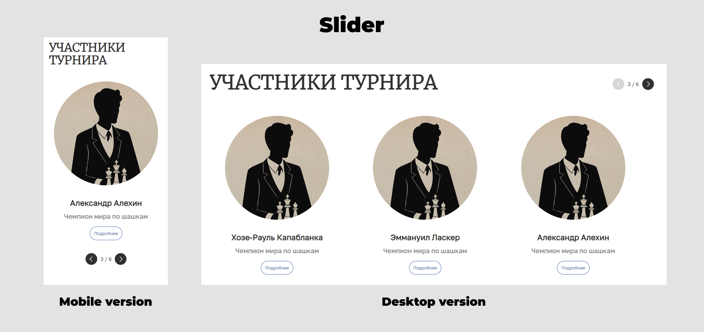
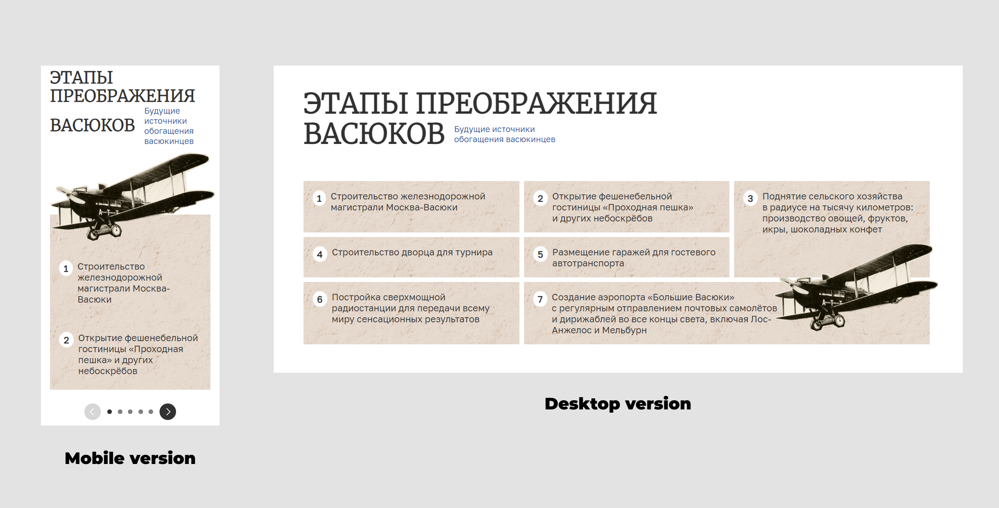

<h1> Web development on HTML + CSS + JS</h1>
<h2><a href="https://liubov5.github.io/chessClubSite/" target="_blank">Link to site</a></h2>
<h3>I used CSS grid, CSS flex to make the site responsive and mobile-first 👇 </h3>

<h3>Two sliders for the mobile  and computer versions</h3>

<h3>Also, I have created GSAP animations, simple animations</h3>

  

    
    <h4>Desktop version</h4>
  

  

    
    <h4>Mobile version</h4>
  

Click on image to watch full example 👇 

